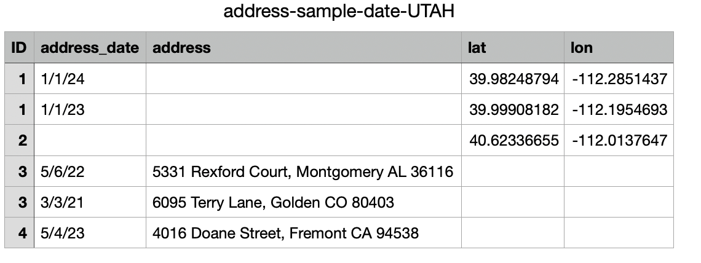
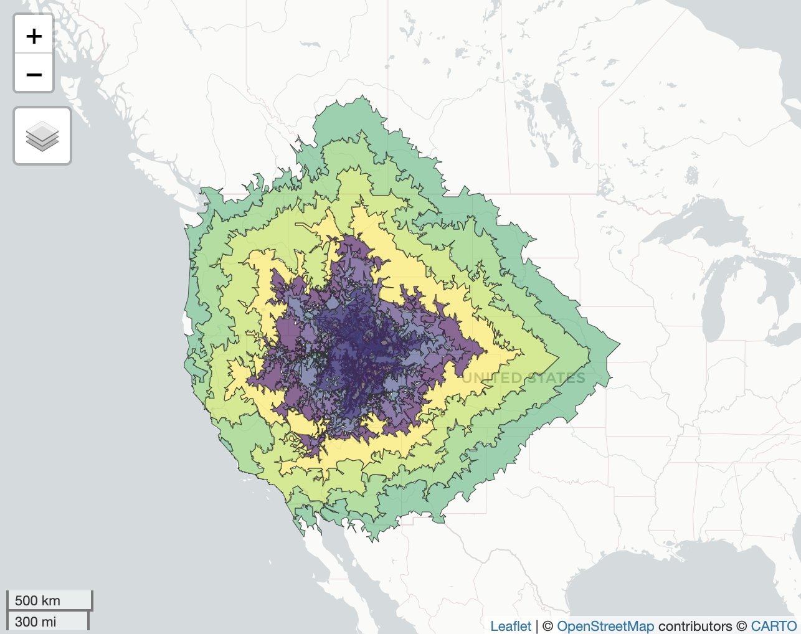

```{r setup, include=FALSE}
knitr::opts_chunk$set(echo = FALSE, message = FALSE, warning = FALSE)
```

```{r}
library(tidyverse)
library(knitr)
library(kableExtra)
library(dplyr)
```

<!-- # geocoder <a href='https://degauss.org'></a> -->

<!-- [](https://github.com/degauss-org/geocoder/releases) -->
<!-- [](https://github.com/degauss-org/geocoder/actions/workflows/build-deploy-release.yaml) -->


<!-- ## Preparation -->

## Introduction
The docker container provides means of geocoding the given list patient addresses and augmenting it with additional information related to the location as well as determining the driving distance (in hours) to the PCGC center.
This is accomplished locally without interacting with cloud based services and thus maintaining the security and privacy of the patient information.

## Requirements
Operating System:
  - Mac
  - Windows?
RAM: 8GB
Disk Space: 20GB (docker container is 10GB)


## Step 0: Install Docker

See the [Installing Docker](https://degauss.org/using_degauss.html#Installing_Docker) webpage.

**_Note about Docker Settings:_**  
After installing Docker, but before running containers, go to **Docker Settings > Advanced** and change **memory** to greater than 4000 MB (or 4 GiB) <br> 
<center>  </center> <br> If you are using a Windows computer, also set **CPUs** to 1. <br> 
<!-- <center>  </center> Click **Apply** and wait for Docker to restart. -->

## Step 1: Preparing Your Input File

The input file must be a CSV file with a column titled `address` containing all address components. Other columns may be present - in particular a participant ID column and a date column are recommended. The software will ignore (but preserve) all additional columns besides `address`.

An example input CSV file (called `my_address_file.csv`) might look like:

<center></center>

Example address .csv files are [my_address_file.csv](tests/my_address_file.csv) or [address-sample.csv](tests/address-sample.csv)


## Step 2: Running the PCGC deGAUSS container (the short version)

If `my_address_file.csv` is a file in the current working directory with an address column named `address`, then the [DeGAUSS command](https://degauss.org/using_degauss.html#DeGAUSS_Commands):

  - macOS:
  
    ```sh
    docker run --rm -v $PWD:/tmp ghcr.io/dohn5r/geocoder_pcgc:0.0.1 \
    -s PCGC_UTAH -i address-sample.csv -o UTAH_output 
    ```
  
  - Windows (CMD):
  
    ```sh
    docker run --rm -v "%cd%":/tmp ghcr.io/dohn5r/geocoder_pcgc:0.0.1 \
    -s PCGC_UTAH -i address-sample.csv -o UTAH_output 
    ```

will produce 3 output files:

- `UTAH_output.csv`: This file has full output data, including PHI data
- `UTAH_output-deid.csv`: This file contains de-identified fields specified by user. By default, de-identified fields are "id","date","matched_state","precision","geocode_result","fraction_assisted_income", "fraction_high_school_edu","median_income","fraction_no_health_ins","fraction_poverty","fraction_vacant_housing", "dep_index","drivetime_selected_center","nearest_center_pcgc","drivetime_pcgc","version"
- `UTAH_output-log.txt`: This file is an output log

Note: The example above uses `PCGC_UTAH` for PCGC center in Utah. To change the care center, replace `PCGC_UTAH` with one of the site abbrevations below. 

| **Abbreviation** |  **Name** |
|--------------------|-------------------|
PCGC_YALE | `Yale`
PCGC_BOSTON | `Boston Childrens`
PCGC_MTSINAI | `Mt. Sinai`
PCGC_COLUMBIA | `Columbia`
PCGC_CHOP | `CHOP`
PCGC_UTAH | `Utah`
PCGC_CHLA | `Childrens of LA`

The `output-deid.csv` file is safe to be sent to the ACC via secure upload to AWS.

### Running the PCGC deGAUSS container (the longer version)

Command line parameters are as follows:

- `-h` or `--help`: Show available parameters. For example, users can use this command:

  ```sh
  docker run ghcr.io/dohn5r/geocoder_pcgc:0.0.1 -h
  ```
or 
  ```sh
  docker run ghcr.io/dohn5r/geocoder_pcgc:0.0.1 --help
  ```

- `-v` or `--version`: Show the current version of Docker container with this command:
  ```sh
  docker run ghcr.io/dohn5r/geocoder_pcgc:0.0.1 -v
  ```
  or 
  ```sh
  docker run ghcr.io/dohn5r/geocoder_pcgc:0.0.1 --version
  ```

- `--site-list`: Print all available sites with this command:
  ```sh
  docker run ghcr.io/dohn5r/geocoder_pcgc:0.0.1 --site-list
  ```


### Required Arguments
This DeGAUSS container requires the following arguments:

- `-i` to specify path to the address file of interest
- `-s` or `--site` to specify the PCGC center of interest

| **Abbreviation** |  **Name** |
|--------------------|-------------------|
PCGC_YALE | `Yale`
PCGC_BOSTON | `Boston Childrens`
PCGC_MTSINAI | `Mt. Sinai`
PCGC_COLUMBIA | `Columbia`
PCGC_CHOP | `CHOP`
PCGC_UTAH | `Utah`
PCGC_CHLA | `Childrens of LA`


### Optional Arguments

This DeGAUSS container has the following optional arguments:

-   `-o` or `--output-file-prefix` to specify prefix of output files. By default, the prefix is `output`, which will generate output.log, output-phi.csv, output-deid.csv
-   `--f` or `--include-deid-fields` to specify list of fields to include in output. Default fields:
    - id, date, precision, geocode_result, fraction_assisted_income, fraction_high_school_edu, median_income, fraction_no_health_ins, fraction_poverty, fraction_vacant_housing, dep_index, drivetime_selected_center, nearest_center_pcgc, drivetime_pcgc, version

### Running the PCGC deGAUSS container (more details)
This Docker image does the following:

- perform geocoding on addresses (if not geocoded already), adding the following columns:

  - **`matched_street`**, **`matched_city`**, **`matched_state`**, **`matched_zip`**: matched address componets (e.g., `matched_street` is the street the geocoder matched with the input address); can be used to investigate input address misspellings, typos, etc.
  - **`precision`**: The method/precision of the geocode. The value will be one of:
    - `range`: interpolated based on address ranges from street segments
    - `street`:  center of the matched street
    - `intersection`: intersection of two streets
    - `zip`: centroid of the matched zip code
    - `city`: centroid of the matched city
  - **`score`**: The percentage of text match between the given address and the geocoded result, expressed as a number between 0 and 1. A higher score indicates a closer match. Note that each score is relative within a precision method (i.e. a `score` of `0.8` with a `precision` of `range `is not the same as a `score` of `0.8` with a `precision` of `street`). 
  - **`lat`** and **`lon`**: geocoded coordinates for matched address
  - **`geocode_result`**: A character string summarizing the geocoding result. The value will be one of
    + `geocoded`: the address was geocoded with a `precision` of either `range` or `street` and a `score` of `0.5` or greater.
    + `imprecise_geocode`: the address was geocoded, but results were suppressed because the `precision` was `intersection`, `zip`, or `city` and/or the `score` was less than `0.5`.
    + `po_box`: the address was not geocoded because it is a PO Box
    + `cincy_inst_foster_addr`: the address was not geocoded because it is a known institutional address, not a residential address
    + `non_address_text`: the address was not geocoded because it was blank or listed as "foreign", "verify", or "unknown" 
    
    
- then join with tract-level deprivation index data derived from the 2018 American Community Survey (ACS), adding the following columns:

  - **`fips_tract_id`**: 2010 census tract identifier
  
  - 2018 American Community Survey variables:
    
    + **`fraction_assisted_income`**: fraction of households receiving public assistance income or food stamps or SNAP in the past 12 months
    + **`fraction_high_school_edu`**: fraction of population 25 and older with educational attainment of at least high school graduation (includes GED equivalency)
    + **`median_income`**: median household income in the past 12 months in 2018 inflation-adjusted dollars
    + **`fraction_no_health_ins`**: fraction of population with no health insurance coverage
    + **`fraction_poverty`**: fraction of population with income in past 12 months below poverty level
    + **`fraction_vacant_housing`**: fraction of houses that are vacant
  
  - **`dep_index`**: composite measure of the 6 variables above
  

- then compute drive time to a Pediatric Cardiac Genomics Consortium (PCGC) specified by user, adding the following columns:
  - **`drivetime_selected_center`**: computed estimated drive time to center specified by user
  - **`nearest_center_pcgc`**: Nearest PCGC center as computed by the Docker image 
  - **`distance_pcgc`**: Distance to the nearest PCGC center as computed by the Docker image 

#### 1. Geocoding
##### Input address data formatting

- Other columns may be present, but it is recommended to only include `address`, an optional identifier column (e.g., `id`) and an optional `address_date` column. Fewer columns will increase geocoding speed.
- Address data must be in one column called `address`. 
- Separate the different address components with a space
- Do not include apartment numbers or "second address line" (but its okay if you can't remove them)
- ZIP codes must be five digits (i.e. `32709`) and not "plus four" (i.e. `32709-0000`)
- Do not try to geocode addresses without a valid 5 digit zip code; this is used by the geocoder to complete its initial searches and if attempted, it will likely return incorrect matches
- Spelling should be as accurate as possible, but the program does complete "fuzzy matching" so an exact match is not necessary
- Capitalization does not affect results
- Abbreviations may be used (i.e. `St.` instead of `Street` or `OH` instead of `Ohio`)
- Use Arabic numerals instead of written numbers (i.e. `13` instead of `thirteen`)
- Address strings with out of order items could return NA (i.e. `3333 Burnet Ave Cincinnati 45229 OH`)

##### Geomarker Data

- `geocoder.db` is a SQL database prepared following the instructions [here](https://degauss.org/manual_install.html) using 2021 TIGER/Line Street Range Address files from the Census
- For this container, it is hosted at `s3://geomarker/geocoder_2021.db`

#### 2. Deprivation index
This container overlays the input latitude and longitude coordinates with 2010 census tracts, then joins with tract-level deprivation index data derived from the 2018 American Community Survey (ACS).

For more information on the deprivation index, please see the [deprivation index page](https://geomarker.io/dep_index/).

##### Geomarker Data

- 2010 tract shape files are stored at: [`s3://geomarker/geometries/tracts_2010_sf_5072.rds`](https://geomarker.s3.us-east-2.amazonaws.com/geometries/tracts_2010_sf_5072.rds).
- 2018 deprivation index data is stored at: [`s3://geomarker/tract_dep_index_2018.rds`](https://geomarker.s3.us-east-2.amazonaws.com/tract_dep_index_2018.rds) and is also available for download at [https://geomarker.io/dep_index/](https://geomarker.io/dep_index/).

#### 3. Drive time

This container uses isochrones to assign drive time to care center for each input address. Drive time isochrones are concentric polygons, in which each point inside a polygon has the same drive time to the care center. Below is an example of drive time isochrones around PCGC center in Utah



Drive time isochrones were obtained using [self-hosted openroute service](https://maps.openrouteservice.org/reach?n1=38.393339&n2=-95.339355&n3=5&b=0&i=0&j1=30&j2=15&k1=en-US&k2=km) in order to overcome the time limitations of publicly available API.

Drive time is computed based on distance between input address and care center:
<center>drive_time = distance/60</center>

There are  24 levels of isochrones with driving distances up to 960 (in minutes): :  15  30  45  60  75  90  105 120 135 150 165 180 195 210 225 240 300 360 420 480 600 720 840 960


<!-- ##### Geomarker Data -->

<!-- - `download_isochrones.R` was used to download and prepare drive time isochrones -->
<!-- - Isochrone shape files are stored at [`s3://geomarker/drivetime/isochrones/`](https://geomarker.s3-us-east-2.amazonaws.com/drivetime/isochrones) -->
<!-- - A list of available care center addresses is also stored at [`s3://geomarker/drivetime/center_addresses.csv`](https://geomarker.s3-us-east-2.amazonaws.com/drivetime/center_addresses.csv) -->


## DeGAUSS Details

For detailed documentation on DeGAUSS, including general usage and installation, please see the [DeGAUSS homepage](https://degauss.org).